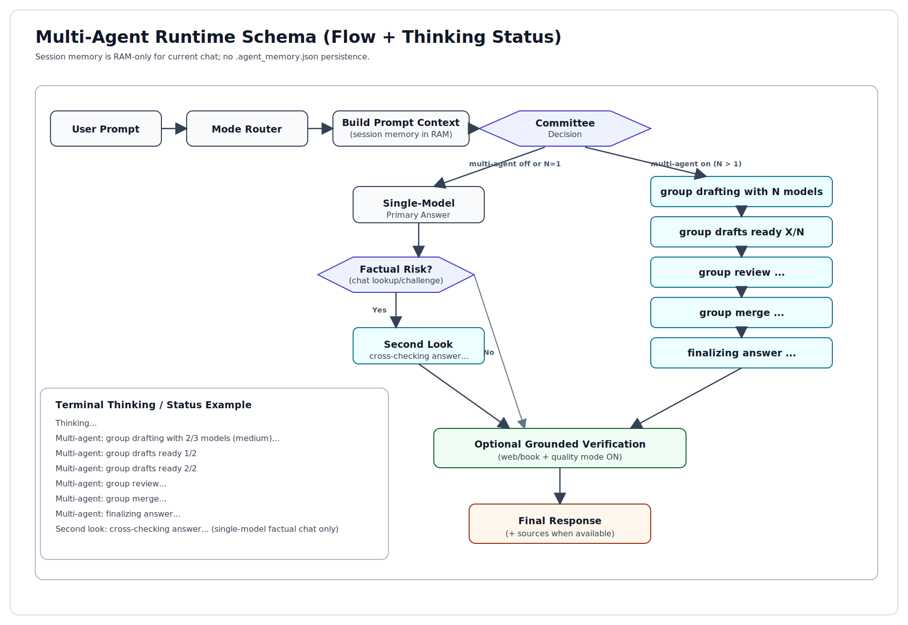

# Local AI Agent

This project runs a local AI assistant with Docker. It can chat, correct text, summarize text, read many file formats from `./files`, save generated files back to `./files`, browse HTTPS web sources with citations, answer questions from indexed books with local RAG, and keep short memory within the current chat session (RAM only).

## Technologies

This project uses [Python](https://www.python.org/), [Docker Engine](https://docs.docker.com/engine/), [Docker Compose](https://docs.docker.com/compose/), and [Ollama](https://github.com/ollama/ollama). Web retrieval is done through local web tools with optional [FastMCP](https://github.com/jlowin/fastmcp). OCR for images uses the [OCR.Space API](https://ocr.space/). The local document QA system uses BM25-style RAG indexes stored in `./rag`. Original inspiration repositories are [AIAgent-MCP](https://github.com/AhilanPonnusamy/AIAgent-MCP) and [FastMCP](https://github.com/jlowin/fastmcp).

## Quick Start (Docker only)

Install Docker Engine and Docker Compose. Docker Desktop is not required.

The current `compose.yaml` is GPU-enabled (`gpus: all` for Ollama). For best performance, run on a machine with a supported GPU.

Create your environment file:

```powershell
copy .env.example .env
```

Edit `.env` and set at least:

```env
OLLAMA_MODEL=gemma3:1b
OCR_SPACE_API_KEY=your_key_here
```

`OLLAMA_MODEL` is only an example. You can use another local model tag such as `gemma3:4b` if your hardware supports it. By default, size capping is disabled (`OLLAMA_MAX_B=0`).

If your machine is limited, use single-model mode instead of committee mode:

```env
AGENT_MULTI_AGENT=off
OLLAMA_MODEL=gemma3:1b
```

Start the assistant:

```powershell
docker compose run --rm --build agent
```
- Note the initialization can take several minutes. 

After the first setup, start normally with:


```powershell
docker compose run --rm agent
```

Stop chat with `Ctrl+C`. Stop and remove everything, including volumes, with:

```powershell
docker compose down -v
```

## Natural Usage

Put files in `./files`, then talk naturally. The router chooses between `web`, `book`, `chat`, `correct`, and `summarize` modes automatically.

```text
Correct this: i has a apple.
Summarize this file: test.docx
What is the latest AI news today?
Summarize https://example.com/page
```

Generated files are always saved to `./files`. If a filename already exists, the agent creates a unique name with `_note`, `_note2`, and so on.

## Book Q&A (RAG)

To ask questions about a new book, index it once:

```powershell
docker compose run --rm agent python agent.py index --file book.pdf
```

You can provide `--name mybook` if you want a custom index name. If `--name` is not provided, the name is derived from the file name.

Then start chat:

```powershell
docker compose run --rm agent
```

Inside chat, load a specific index with `/book mybook` or disable book mode with `/book off`. By default, the latest index auto-loads on startup. You can disable that with `AGENT_AUTO_BOOK=off`, or force a specific default with `AGENT_DEFAULT_BOOK=<index_name>`.

For PDF indexing, all pages are read by default. You can cap this with `AGENT_MAX_PDF_PAGES`.

## Introducing Multi-Agent Reasoning

You can combine several small local models so the agent answers as a group, not one model after another. The agent now selects how many models to use based on question complexity, runs the selected models in parallel, assigns complementary roles, and performs peer review before final merge.

```env
AGENT_MULTI_AGENT=on
AGENT_MULTI_MODELS=gemma3:1b,llama3.2:3b,qwen2.5:1.5b
AGENT_MULTI_SCOPES=chat,research,book,summarize,correct
AGENT_MULTI_SMART=on
AGENT_STRICT_ACCURACY=on
AGENT_MULTI_SIMPLE_MODELS=1
AGENT_MULTI_MEDIUM_MODELS=2
AGENT_MULTI_HARD_MODELS=0
AGENT_MULTI_ROLE_MODE=on
AGENT_MULTI_PEER_REVIEW=on
AGENT_MULTI_REVIEWERS=0
AGENT_MULTI_MAX_WORKERS=0
AGENT_CHAT_SECOND_LOOK=on
```

`AGENT_MULTI_HARD_MODELS=0` means hard questions use all configured models. `AGENT_MULTI_MAX_WORKERS=0` means all selected models run in parallel. `AGENT_MULTI_ROLE_MODE=on` enables role split (solver, skeptic, grounding, editor). `AGENT_MULTI_PEER_REVIEW=on` makes models review each other before merge. `AGENT_MULTI_REVIEWERS=0` means all selected models review. `AGENT_CHAT_SECOND_LOOK=on` enables a second-model factual cross-check for risky chat answers when only one draft model is used. `AGENT_STRICT_ACCURACY=on` enables a post-answer audit pass for non-correction tasks. If you want always-all behavior, set `AGENT_MULTI_SMART=off`. If you want single-model behavior, set `AGENT_MULTI_AGENT=off`.

### Multi-Agent Schema



## Progress and Quality

The terminal shows live phases such as understanding, searching, fetching, writing, and verifying. You can tune visibility with `AGENT_PHASE_ECHO`, `AGENT_PHASE_STYLE`, `AGENT_STATUS_REPEAT_S`, `AGENT_STATUS_CLEAR_S`, and `AGENT_THINK_HEARTBEAT_S`.

Quality controls are enabled by default and include grounded verification against sources and stricter retries for uncertain answers. You can switch this in chat with `/quality on` and `/quality off`.

## OCR Language

For OCR, the agent infers language from the prompt and displays the active OCR language while processing. If prompt language is unclear, it falls back to `OCR_SPACE_LANGUAGE` from `.env` (default `eng`).

## Troubleshooting

If configuration or code changed, rebuild:

```powershell
docker compose run --rm --build agent
```

If you want a full reset:

```powershell
docker compose down -v
```

If file reading fails, verify the file is inside `./files` and that the file itself is valid.

## Report Issues

If you find a bug or wrong answer, please report it with the exact prompt, full terminal output, file name and type (if used), date/time, and operating system.

## Disclaimer

This project is under active development. Behavior, commands, and outputs can change at any time. Review important outputs before production or high-stakes use.

## License

This project is licensed under Creative Commons Attribution-NonCommercial 4.0 International (CC BY-NC 4.0). See `LICENSE` for details.
