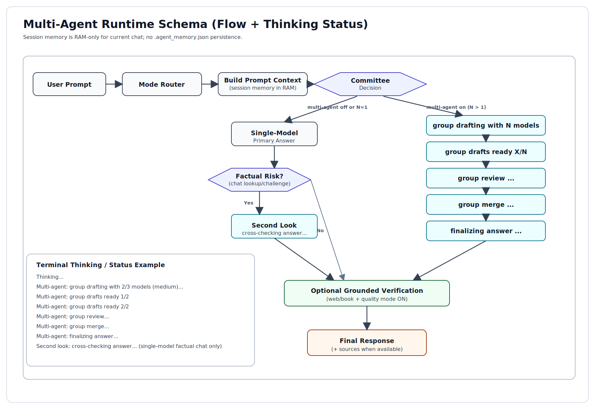

# Local AI Agent

This project runs a local AI assistant with Docker. It can chat, correct text, summarize text, read many file formats from `./files`, save generated files back to `./files`, browse HTTPS web sources with citations, answer questions from indexed books with local RAG, and keep short memory within the current chat session (RAM only).

You can use it through a **modern web UI** (default) or a **terminal CLI** — same features either way.

## Technologies

This project uses [Python](https://www.python.org/), [Docker Engine](https://docs.docker.com/engine/), [Docker Compose](https://docs.docker.com/compose/), and [Ollama](https://github.com/ollama/ollama). Web retrieval is done through local web tools with optional [FastMCP](https://github.com/jlowin/fastmcp). OCR for images uses the [OCR.Space API](https://ocr.space/). The local document QA system uses BM25-style RAG indexes stored in `./rag`. Original inspiration repositories are [AIAgent-MCP](https://github.com/AhilanPonnusamy/AIAgent-MCP) and [FastMCP](https://github.com/jlowin/fastmcp).

## Quick Start (Docker only)

Install Docker Engine and Docker Compose. Docker Desktop is not required.

> **Heads up — first run is slow.** The initial `docker compose up -d --build` pulls the local LLM weights into the Ollama volume, which can take **up to ~15 minutes** depending on your internet speed (and longer for larger models or multi-agent setups that pull several at once). Subsequent runs reuse the cached weights and start in seconds.

> **A GPU is strongly recommended.** The current `compose.yaml` is GPU-enabled (`gpus: all` for Ollama) and the local models run dramatically faster on a supported GPU. CPU-only is possible but expect noticeably slower responses, especially in multi-agent mode.

Create your environment file:

```powershell
copy .env.example .env
```

Edit `.env` and set at least:

```env
OLLAMA_MODEL=qwen3:1.7b
OCR_SPACE_API_KEY=your_key_here
```

`OLLAMA_MODEL` is only an example. You can use another local model tag if your hardware supports it. By default, size capping is disabled (`OLLAMA_MAX_B=0`).

If your machine is limited, use single-model mode instead of committee mode:

```env
AGENT_MULTI_AGENT=off
OLLAMA_MODEL=qwen3:1.7b
```

### Web UI — one command

Start everything (Ollama, model pull, web UI) with one command:

```powershell
.\start.cmd       # Windows
./start.sh        # macOS / Linux
```

> **macOS / Linux only:** if `./start.sh` says *Permission denied*, make the scripts executable once with `chmod +x start.sh stop.sh` and re-run. Windows users skip this step.

The first time you run it, the script asks **"Enable voice input? [y/N]"**. Your answer is persisted to `.env` (as `ENABLE_VOICE=true|false`) so you're never asked again. Pick *y* and the heavy [WhisperX](https://github.com/m-bain/whisperx) speech-to-text container is built and started alongside the rest; pick *N* and it's skipped entirely (no ~1.5 GB image, no model download). Either way, the script then runs the equivalent of `docker compose up -d --build`.

Then open **http://localhost:8000** in your browser. The first run takes a few minutes (model pull + image build). Subsequent runs reuse your saved preference and start fast — same script, no second prompt.

To **change your mind later** about voice, delete the `ENABLE_VOICE=` line from `.env` and re-run the start script — it'll ask again.

Power users who want to skip the wrapper can run `docker compose up -d --build` directly: that brings up everything *except* WhisperX. To force voice on without the wrapper, pass the profile explicitly: `docker compose --profile voice up -d --build`.

The web UI gives full feature parity with the CLI: chat with live phase updates, web research, book Q&A with index upload, file correction/summarization with download, model picker (switch primary model and toggle committee members in one click), pull new models from inside the UI, plus quality and multi-agent settings.

### Lifecycle — start / stop

| Script                     | What it does                                                                 |
| -------------------------- | ---------------------------------------------------------------------------- |
| `start.cmd` / `start.sh`   | Boot everything. Asks once about voice, then `docker compose up -d --build`. |
| `stop.cmd` / `stop.sh`     | **Full uninstall.** Deletes containers, named volumes (Ollama models + WhisperX cache + RAG indexes inside the volume), and locally-built images. Asks for confirmation. Re-run `start.*` to set up again from scratch. |

To also reclaim disk used by *other* unused Docker objects on your machine (not just this project), run `docker system prune -a` after `stop.*`.

> **Warning:** `docker system prune -a` removes **all** dangling/unused images on your machine, not just the ones from this project. Skip it if you have other Docker projects whose cached images you want to keep.

### Terminal CLI (optional)

Prefer a terminal? Run the CLI service instead:

```powershell
docker compose run --rm agent
```

The CLI service is in the `cli` profile so it doesn't auto-start with `docker compose up` — only the web UI does. The single command above is enough; Docker resolves the profile on demand.

Stop with `Ctrl+C` to exit the CLI. To uninstall everything (containers, volumes, models, built images), use `stop.cmd` / `stop.sh` (see the Lifecycle table above).

## Natural Usage

Put files in `./files`, then talk naturally. The router chooses between `web`, `book`, `chat`, `correct`, and `summarize` modes automatically.

```text
Correct this: i has a apple.
Summarize this file: test.docx
What is the latest AI news today?
Summarize https://example.com/page
```

Generated files are always saved to `./files`. If a filename already exists, the agent creates a unique name with `_note`, `_note2`, and so on.

## Book Q&A (RAG)

To ask questions about a new book, index it once:

```powershell
docker compose run --rm agent python agent.py index --file book.pdf
```

You can provide `--name mybook` if you want a custom index name. If `--name` is not provided, the name is derived from the file name.

Then start chat:

```powershell
docker compose run --rm agent
```

Inside chat, load a specific index with `/book mybook` or disable book mode with `/book off`. By default, the latest index auto-loads on startup. You can disable that with `AGENT_AUTO_BOOK=off`, or force a specific default with `AGENT_DEFAULT_BOOK=<index_name>`.

For PDF indexing, all pages are read by default. You can cap this with `AGENT_MAX_PDF_PAGES`.

## Introducing Multi-Agent Reasoning

You can combine several small local models so the agent answers as a group, not one model after another. The agent now selects how many models to use based on question complexity, runs the selected models in parallel, assigns complementary roles, and performs peer review before final merge.

```env
AGENT_MULTI_AGENT=on
AGENT_MULTI_MODELS=qwen3:1.7b,llama3.2:3b,gemma3:4b
AGENT_MULTI_SCOPES=chat,research,book,summarize,correct
AGENT_MULTI_SMART=on
AGENT_STRICT_ACCURACY=on
AGENT_MULTI_SIMPLE_MODELS=1
AGENT_MULTI_MEDIUM_MODELS=2
AGENT_MULTI_HARD_MODELS=0
AGENT_MULTI_ROLE_MODE=on
AGENT_MULTI_PEER_REVIEW=on
AGENT_MULTI_REVIEWERS=0
AGENT_MULTI_MAX_WORKERS=0
AGENT_CHAT_SECOND_LOOK=on
```

`AGENT_MULTI_HARD_MODELS=0` means hard questions use all configured models. `AGENT_MULTI_MAX_WORKERS=0` means all selected models run in parallel. `AGENT_MULTI_ROLE_MODE=on` enables role split (solver, skeptic, grounding, editor). `AGENT_MULTI_PEER_REVIEW=on` makes models review each other before merge. `AGENT_MULTI_REVIEWERS=0` means all selected models review. `AGENT_CHAT_SECOND_LOOK=on` enables a second-model factual cross-check for risky chat answers when only one draft model is used. `AGENT_STRICT_ACCURACY=on` enables a post-answer audit pass for non-correction tasks. If you want always-all behavior, set `AGENT_MULTI_SMART=off`. If you want single-model behavior, set `AGENT_MULTI_AGENT=off`.

### Multi-Agent Schema



## Progress and Quality

The terminal shows live phases such as understanding, searching, fetching, writing, and verifying. You can tune visibility with `AGENT_PHASE_ECHO`, `AGENT_PHASE_STYLE`, `AGENT_STATUS_REPEAT_S`, `AGENT_STATUS_CLEAR_S`, and `AGENT_THINK_HEARTBEAT_S`.

Quality controls are enabled by default and include grounded verification against sources and stricter retries for uncertain answers. You can switch this in chat with `/quality on` and `/quality off`.

## Sub-Agent Spawning

For genuinely multi-part requests ("research X and Y, then explain how they relate"), the agent can split the prompt into independent sub-tasks, run them **in parallel** as fresh sub-agents, and synthesize one final answer.

```env
AGENT_SUBAGENTS=on            # default: off (opt-in — adds a planner LLM call)
AGENT_SUBAGENTS_MAX=3         # ceiling on number of sub-tasks per request
AGENT_SUBAGENTS_MAX_WORKERS=0 # 0 = run all sub-agents in parallel
```

How it works:

1. A **planner** LLM call decides whether the request decomposes into 2+ self-contained sub-tasks. If not, it returns nothing and the agent falls back to the normal single-mode pipeline.
2. Each sub-task is dispatched with a `scope` of either `chat` (reasoning / explanation from model knowledge) or `research` (web lookup with sources). Sub-agents run in **fresh memory** so they don't pollute each other.
3. A **synthesizer** call merges the sub-agent outputs into one cohesive answer, preserving any sources collected along the way.

Sub-agents do not recursively spawn more sub-agents (depth is capped at 1) and only fire when the planner finds at least two genuinely independent tasks.

## Context Compression

Long chat sessions get **summarized** instead of just truncated. Once accumulated chat memory exceeds a configurable byte threshold, the older portion is replaced with a single LLM-generated briefing that keeps the user's goals, key facts, and pending tasks — while the most recent turns stay verbatim so the model has fresh dialogue to react to.

```env
AGENT_MEMORY_COMPRESS=on                    # default: on
AGENT_MEMORY_COMPRESS_THRESHOLD_CHARS=8000  # compress when memory exceeds this
AGENT_MEMORY_KEEP_RECENT_TURNS=4            # always keep last N user/assistant pairs verbatim
```

Compression runs both in the web UI and the CLI chat loop, and a leading summary is preserved across subsequent compression rounds so context isn't lost over very long sessions. Settings → *Context compression* in the web UI exposes the toggle and thresholds at runtime.

## Voice Input (talk to the agent)

Voice input is **opt-in at install time**. The first time you run `start.cmd` / `start.sh`, the script asks whether to enable voice. If you say no, the WhisperX container is never built — no ~1.5 GB image, no model download, no extra resources used. If you say yes, a local [WhisperX](https://github.com/m-bain/whisperx) speech-to-text microservice is built and started alongside the other services.

When voice is installed and reachable, the web UI shows a one-time confirmation modal on first load and a **Talk** button appears next to *Send* in the chat composer. Click **Talk** to start recording from your microphone, click it again to stop. The clip is sent to the local WhisperX service (audio never leaves your machine) and the transcript is dropped into the chat input — review or edit it, then hit *Send* like a normal message.

You can disable the mic button per-browser any time from **Settings → Voice input** without rebuilding anything. To remove voice entirely (free disk + stop the container), delete the `ENABLE_VOICE=true` line from `.env`, set it to `false`, and run `docker compose down whisperx` followed by your next `start.cmd` / `start.sh`.

Defaults:

```env
WHISPERX_MODEL=tiny           # tiny / base / small / medium / large-v3
WHISPERX_DEVICE=auto          # auto = cuda when available, else cpu
WHISPERX_COMPUTE_TYPE=        # auto-picked: float16 on cuda, int8 on cpu
WHISPERX_BATCH_SIZE=8
WHISPERX_TIMEOUT_S=120
```

> **First run note.** The WhisperX service downloads the chosen model on first start (the `tiny` model is ~75 MB; `base`/`small`/`medium` are larger). Weights are cached in the `whisperx_cache` Docker volume so subsequent boots are instant. WhisperX is fast enough on CPU for short voice messages with the `tiny` model, but adding `gpus: all` to the `whisperx` service in `compose.yaml` (mirroring the `ollama` service) makes it dramatically faster.

> **Browser permission.** Recording requires microphone access; your browser will prompt the first time. The mic button needs a secure context (`https://` or `http://localhost`) — direct LAN IP access without HTTPS will be blocked by the browser.

## OCR Language

For OCR, the agent infers language from the prompt and displays the active OCR language while processing. If prompt language is unclear, it falls back to `OCR_SPACE_LANGUAGE` from `.env` (default `eng`).

## Troubleshooting

If configuration or code changed, rebuild:

```powershell
docker compose run --rm --build agent
```

If you want a full uninstall:

```powershell
docker compose down -v
```

If file reading fails, verify the file is inside `./files` and that the file itself is valid.

## Report Issues

If you find a bug or wrong answer, please report it with the exact prompt, full terminal output, file name and type (if used), date/time, and operating system.

## Disclaimer

This project is under active development. Behavior, commands, and outputs can change at any time. Review important outputs before production or high-stakes use.

## License

This project is licensed under Creative Commons Attribution-NonCommercial 4.0 International (CC BY-NC 4.0). See `LICENSE` for details.
